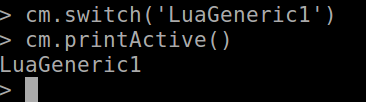
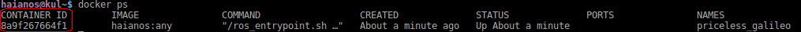
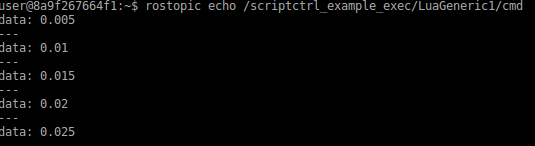
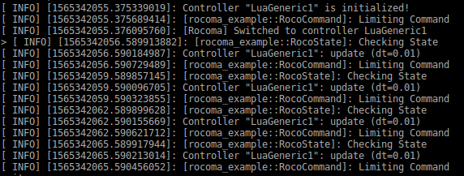

# Technical Report 

*Author: Enea Scioni*

*Date: 09/08/2019*

*Repository: [https://github.com/haianos/rocoma-sandbox](https://github.com/haianos/rocoma-sandbox)*

## Goals

*  to show my understanding on ANYbotics software, with focus on `rocoma` controller manager;
* to show my understanding on the C++ coding style and programming techniques used in ANYbotics, and my skills of maintaining, proposing and implement changes;
* to propose new solutions, as a preview/proof-of-concept of what can be realised (if further developed), aiming to fast prototyping and deployment of `rocoma` controllers, also at runtime. These features are **complementary** to the existing infrastructure, and they are integrated following the same programming techniques used by the original developers.

Concretely, the "exercise" will embed a scripting language in the Controller Manager, to handle few operations and to allow the implementation of controllers using a different programming language (and programming paradigms) than the one provided by the `C++` interface.

A demo and it's code is provided in this repository, as well as in  a docker container (a `Dockerfile` is provided).

All of these shows necessary skills for the position of Field Robotics Engineer, for which knowledge of the entire robotics software architecture is a must.

## Rocoma

In one liner, `rocoma` is a controller manager that allows to manage controllers, plugins and the `shared modules` between controllers.

`rocoma` is developed in `C++11`, and it is strongly header/template-based. This delegates to the compiler to perform optimisation over the generated binaries, and a late choice of the employed `state`, `command` and `shared modules`, but still at *compilation time*. Because of most of the classes of rocoma library are template-based classes, their implementation is fully contained in the header files (`.tpp` extension for separating the implementation). This may lead to a low reconfigurability feature at runtime.

`rocoma` makes use of few advanced `C++11` features, such as synchronization primitives as `std::promise` and `std::future`.

Controller plugins are based on the pattern provided and suggested by `ROS1` (`pluginlib`).

`rocoma` is built on top of  `any_node`: activities (aka, `workers`) are wrapped around multi-threaded `ROS1` spinners, providing a simple and common interface to map activities into threads. This form the basis for a component-based mini-framework.

## The "exercise"

This programming exercise consists in creating a controller for `rocoma` that embed a scripting language (`Lua`), such that the controller code can be programmed not only in `C++`, but also in `Lua`, bringing a set of advantages as described below.

Furthermore, a `Lua` REPL interface is provided in the controller manager itself, to inspect which controllers are available and to swap controllers at runtime, as an alternative of the `ROS` interface. If further developed, this enables scripting possibilities for program and automate high-level behaviour of the controller manager.

The execution of this exercise starts from the `rocoma_example` available online.

### Advantages

Some of the most noticeable advantages are:


* Integration by embedding/extending an application instead of integration by communication: following the `ROS` philosophy (mainstream nowadays in Robotics),  integration of software components is done by means of a technological key-enabler such as a communication middleware. In this way, different "nodes" (OS processes) developed in different programming languages/style/etc can interact between each other. However, this solution creates a relevant overhead, in terms of: required computation (e.g., serialising/deserialising), networking issues, latencies, etc. All of these are to be avoided in the context of motion control with strong real-time requirements.  This example shows *language interoperability* as a mean of integrating pieces of software developed in different languages (the target scripting language is `Lua`, the same can be realised in `Python` or other scripting languages);
 * "hot" swap of the controllers and their implementation. When developing a controller in `C++`, its implementation choices are defined at *compile time*. The presented proof-of-concept allows of having a generic controller interface (realised in `C++`) that embed a controller implementation written in `Lua`. In this way, the controller can be written in an interpreted language and certain choices can be taken also at *runtime*, allowing a large degree of reconfigurability. It is possible to think, for example, of "battery" of controllers made in this way, which are ready to be loaded-unloaded dynamically, with their implementation changed at *runtime*. This solution ease fast development and testing, but also remote maintenance. No need of (re-)compile the controller, thus no need to "stop" the controller manager to perform a change in the implementation.
 * Introspection with a scripting language (`Lua`) of the controller manager without the need of "communicating" by means of `ROS`. This enables a `REPL` interface with a fully-fledged scripting language that has access (limited, on purpose) to the controller manager facilities. This can be used to automate testing procedure and to define (part of) the application behaviour.  Obviously, this option is not suggested for remote introspection of the controller manager.

All of this ease fast prototyping and  deployment of the robotic applications.

## Run the demo

### Run with Docker

The demo is provided also as `docker` container. A `Dockerile` can be found in the `docker` subfolder of the project.

To build the container (this may take few minutes):

```bash
docker build -t haianos:any .
```

To run the container:

```bash
docker run -it haianos:any
```

#### 	Troubleshooting

Depending on your network configuration, sometimes docker may have some issues on DNS resolution. This usually happens if you are behind  a company network. Typical symptoms are, during the building phase, the impossibility to fetch `archive.ubuntu.com` or to resolve `github.com` host to download the source code. This happens because docker, for each image created (also a temporal one), takes the default DNS from your host.  A possible fix is to setup `/etc/docker/daemon.json` indicating the DNS available, including a list of fallback addresses (eg, google's `8.8.8.8`)

```json
{
    "dns": ["134.58.127.1", "8.8.8.8"]
}
```

and restart

```bash
sudo service docker restart
```


[Source](https://development.robinwinslow.uk/2016/06/23/fix-docker-networking-dns/)


### Run from sources

The demo can be compiled by downloading the sources and compiled in a `catkin` workspace with all solved dependencies (`rocoma`). It has been tested on Ubuntu 16.04 LTS and ROS kinetic.

### Run the demo step-by-step

(Note: those instructions follows the provided docker container. Single steps may change otherwise)

```bash
source ws/devel_isolated/setup.bash
```

```bash
roslaunch scriptctrl_example lscript_example.launch
```

The `Lua` REPL provides a fully-fledged `Lua` scripting environment, with the access to few controller manager functionalities. Currently, the following are the allowed operations on the control manager:

```
getControllers
getActiveControllerName
printControllers        
printActive 
switch
```

For example, to print the controllers available is suffice to type:

```
> cm.printControllers()
```

and the expected output is:


```
Grasp
LuaGeneric1
StandAndGrasp
WalkAndGrasp
WalkRos
```

We now switch to the 'LuaGeneric1' controller, a controller container that load a specified controller implemented in Lua.

```
> cm.switch('LuaGeneric1')
```

Let's check if the controller is active with:

```
> cm.printActive()
```

The output will look like:




If the controller is running fine, then we can also visualise the (ROS) command sent over the network. To this end, let's open another terminal and check the `CONTAINER ID` of the running docker image with:

```
docker ps
```



Once the `CONTAINER ID` has been found, type:

```bash
docker exec -i -t <CONTAINER ID> /bin/bash
```

to access to another terminal. From there, we source again and we subscribe to `/scriptctrl_example_exec/LuaGeneric1/cmd` topic:

```
source ws/devel_isolated/setup.bash
rostopic echo /scriptctrl_example_exec/LuaGeneric1/cmd
```

This visualises the command (`std_msgs/Float64`) sent by the running controller, as shown in the following picture



From the main terminal, to close the `Lua` REPL interface type:

```
> quit
```

Note: this won't kill the Controller Manager.

Prior to launch the application, you may want to modify the file `rosconsole.config` in `scriptctrl_example` folder, such as:

```
log4j.logger.ros=INFO #was WARN
```

This enables back the `MELO_INFO_STREAM` printouts, which is disabled by default to keep the screen clean for the REPL interface. An example of such an output is shown below:



### What's happened beyond the screen?

The controller loads a `Lua ` script that contains the implementation of the controller. From `Lua`, it is possible to access to few functionalities of the controller container (in C++), including access to `State`, `Command` and a `ROS` publisher.

The controller (in `scriptctrl_example/controllers/LuaGeneric1.lua`) looks like this:

```lua
function initialize(dt)
  log.MELO_INFO_STREAM('Controller "'..lcmod.getName()..'" is initialized!')
  local state = lcmod.getState()
  state:setValue(0.0)
  return true
end

function advance(dt)
  log.MELO_INFO_STREAM('Controller "'..lcmod.getName()..'": update (dt='..tostring(dt)..')')
  local k = 0.5;
  command = lcmod.getCommand()
  state   = lcmod.getState()
  command:setValue(state:getValue()+(k*dt))
  -- send command to ROS topic as well
  lcmod.pubCmd(command:getValue())
  -- emulate ideal case
  state:setValue(command:getValue())
  return true
end

function reset(dt)
  log.MELO_INFO_STREAM('Controller "'..lcmod.getName()..'": reset (dt='..tostring(dt)..')')
  return initialize(dt)
end

function preStop()
  log.MELO_INFO_STREAM('Controller "'..lcmod.getName()..'": pre-stop')
  return true
end

function stop()
  log.MELO_INFO_STREAM('Controller "'..lcmod.getName()..'": stop')
  return true
end

function cleanup()
  log.MELO_INFO_STREAM('Controller "'..lcmod.getName()..'": cleaup')
  return true
end

function swap(dt)
  if lcmod.isInitialized() then
    return reset(dt)
  else
    return initialize(dt)
  end
  return true
end
```

Of course, it is possible to import `Lua` modules or writing regular `Lua` programs.

Further developments will allow to re-load (or overwrite) the implementation of previously defined controller methods. This enables to stop the controller, change its settings (or modifying full implementation), **without** the need to shutdown the controller manager and thus the robot itself.

